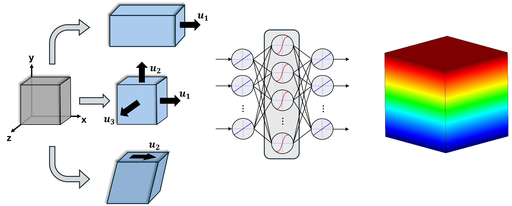

# FEM_NN
This repository contains essential files for a project aimed at developing and implementing deep learning models to predict the constitutive behavior—linking strain and stress—in finite element (FE) simulations. These models are designed as surrogates for material models within FE solvers, enabling faster and more efficient simulations.

---

## 📂 Repository Structure

- **`Raw_Data/`**: Raw data files generated from FE simulations. These include strain-stress datasets used for training and testing.
- **`Pre_Processing_Files/`**: Scripts for extracting, preprocessing raw data.
- **`NN_Model_Files/`**: Contains deep learning models, including:
  - Example cases for testing and experimentation.
  - Pre-trained weights for immediate use.
- **`GUI/`**: Contains all necessaray files to execute a GUI built along this thesis for a more streamlined workflow
- **`UMAT_Files/`**: Contains User Material Subroutine files
---
